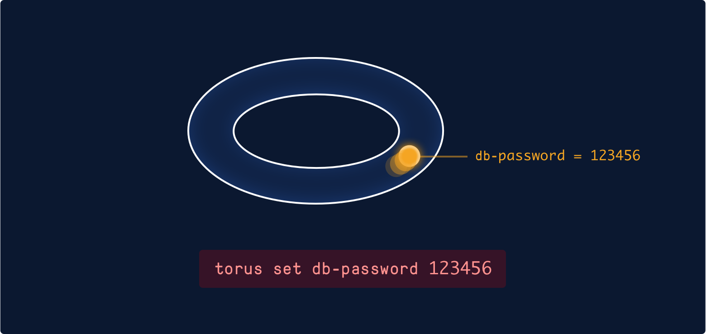
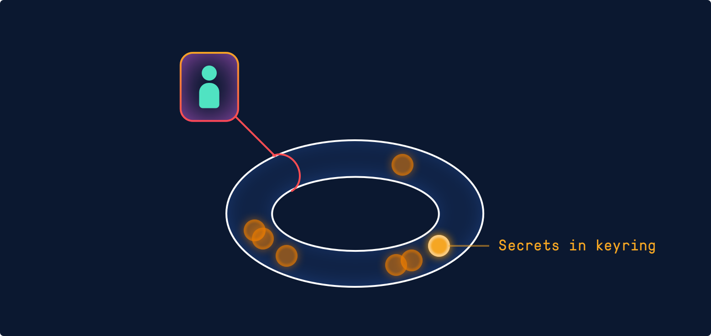
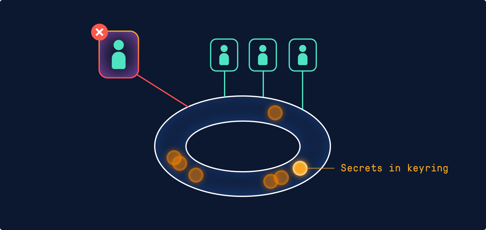
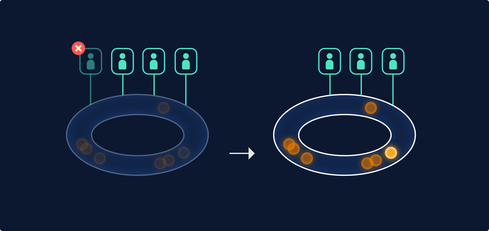
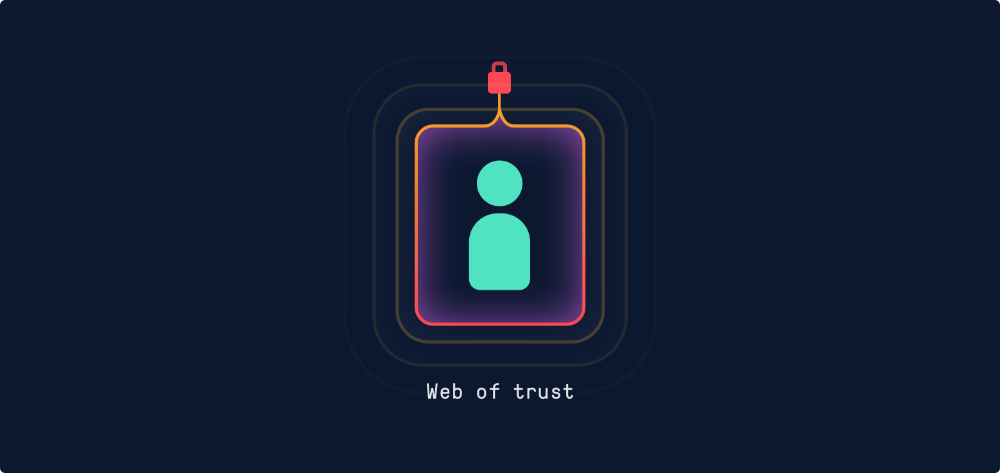
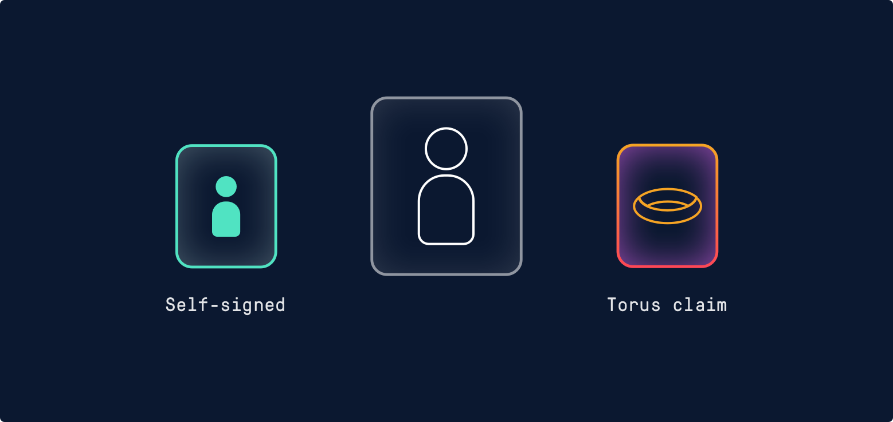

# Crypto

Torus has been designed from the ground up to provide end-to-end encryption on the client. The server never has access to the plaintext secrets or any key material used for encryption.

Signing and encryption key pairs are generated and uploaded to the server by the client for each organization a user belongs to. The private key components are encrypted using material derived from the user’s password. None of the material used for encrypting the private keys is ever shared with the server.

All objects in Torus's cryptography system are signed by their author with content addressable identifiers providing [non-repudiation](https://en.wikipedia.org/wiki/Non-repudiation) and [integrity checking](https://en.wikipedia.org/wiki/Data_integrity).

## Keyring

A keyring is the atomic unit for sharing secrets between users and machines in Torus. Each keyring has a Master Encryption Key (MEK).

## Secrets

Secrets are [content-addressable](https://en.wikipedia.org/wiki/Content-addressable_storage) and signed by their author, independently versioned, and belong to a keyring.

They’re encrypted on the client using a key derived from the ring’s MEK and a unique [nonce](https://en.wikipedia.org/wiki/Cryptographic_nonce). The server verifies that the user has the appropriate access to upload a secret to the specific ring based on their team and org memberships.

### Granting Access to Secrets

Users gain access to secrets by becoming members of the appropriate keyring. A user is added to a keyring when they become members of a team with access to a secret. Access is granted or denied by attaching policies to a team.

For example, granting the devops team access to read all secrets in the production environment adds all subsequent members to all production environment keyrings.

A user becomes a keyring member when another client encrypts the ring’s MEK using a public encryption key belonging to the user.

### Removing Access to Secrets

A user's access to a keyring is revoked when they are removed from a team or organization, or if they reset their password. When a member is revoked the ring and all underlying secret values are marked as requiring rotation. The user’s share of the master encryption key is immediately deleted by the Torus server.

A keyring rotation is performed by another user using the worklog command or by setting a new value for any affected secrets using the set command.

Rotation involves generating a new master encryption key that is then shared the appropriate users by encoding them as members. This new key is never shared with any users who have had their membership revoked.

Once all underlying secrets have been updated the rotation is complete.

## Users

When a user joins an org, Torus generates and uploads the following keys:

- **Encryption keys** are used to encrypt and decrypt data on the client.
- **Signing keys** are used to validate the integrity and authenticity of data entering and leaving the system.

The private components of these keys are encrypted on the client using material derived from the user’s password. They are then signed and uploaded to the server to make it easy for users to move between systems.

> Material used for encryption is never shared with the server. Your secrets cannot therefore be
decrypted on the server.

The public key components are then signed by the Torus server, tying the key and the underlying user together while creating a shallow web of trust. This signature is used by other clients (and the server itself) to validate ownership of any public keys in the system to another user or machine.

The keys used by the system are subsequently signed by an offline root key; these keys are known as the live signing keys. The public component of the offline root key is bundled with the client during the build process.

In future, the client will fully navigate the web of trust to validate the authenticity of keys back to the root key.

_This is an early version of Torus and the Getting Started guide and we'd love your feedback. You can
get in touch by hitting the chat bubble on the bottom-right, or sending us an [email](mailto:support@torus.sh)._
